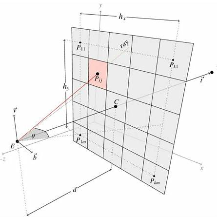
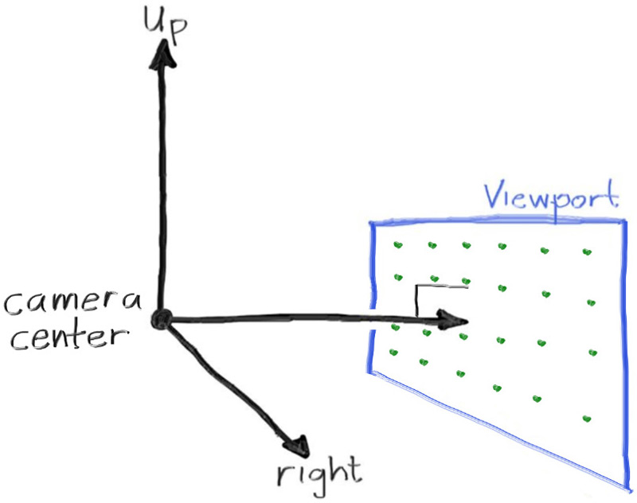
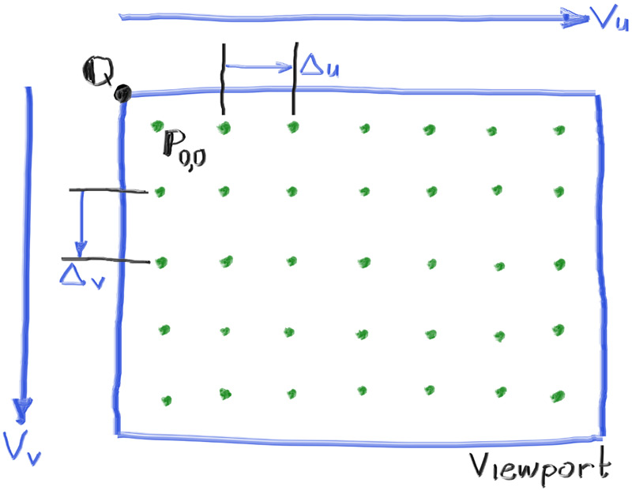

# hoshi

## What even is ray-tracing?

Or more accurately, a path tracer?

According to Wikipedia:

> Path tracing is a rendering algorithm in computer graphics that simulates how
> light interacts with objects, voxels, and participating media to generate
> realistic (physically plausible) images.

So in simpler terms, it makes images. Moreover, it sends rays through pixels and
computes the color seen in the direction of those rays.

## The PPM format

## The vec3 struct

## Rays, camera, and background

Viewport is a conceptual rectangle in 3D space through which the camera views
the scene (think a person looking through a window, they can only move their
head, not the window), and through which rays are cast.

The rendered image is a 2D grid of pixels, each corresponding to a point (or
subregion) on the viewport. For each pixel, you compute a ray that passes
through the corresponding viewport coordinate and trace it into the scene (think
the final image your program writes — a rasterized result of what the camera
"saw" through the viewport).

The camera is a point in 3D space from which all scene rays are cast. The
distance between the camera and the viewport is called the focal length.

In the diagram, we follow the right-handed coordinate system, where Up is
positive Y, Right is positive X, and Forward (the camera's viewing direction) is
negative Z.

[Annotated lerp function](./src/color.rs).
